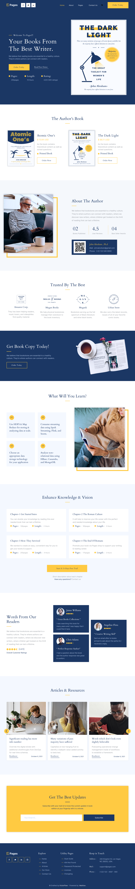

###### Для виконання тестового завдання ви повинні використати:

---

-   1)БЄМ
-   2)SASS з розбивкою на смислові файли, використовувати перемінні та міксіни.
-   3)Перевірити всі блоки на Pixel Perfect
-   4)Готову роботу закинути на гіт та скинути посилання мені в лс

---

